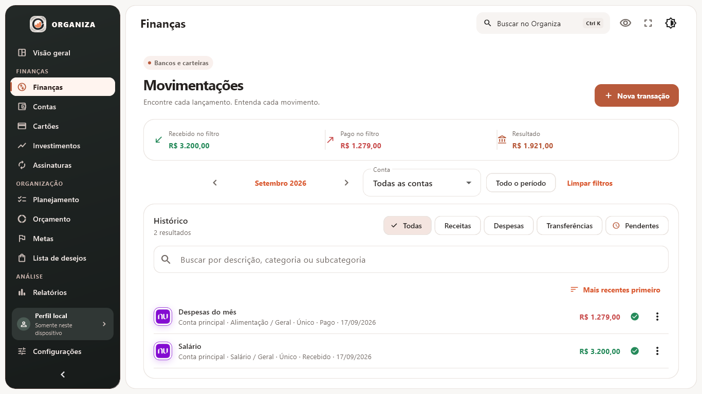
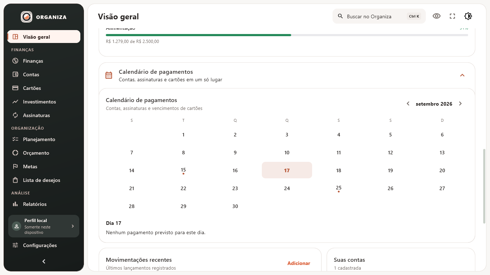
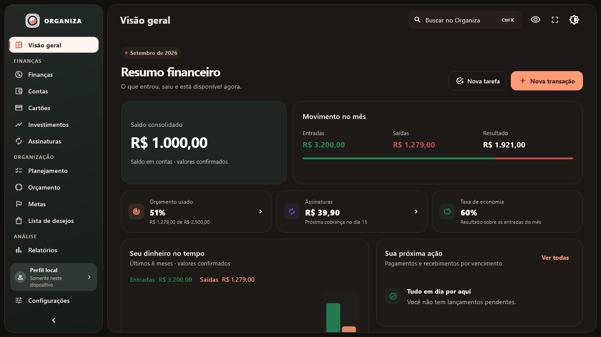
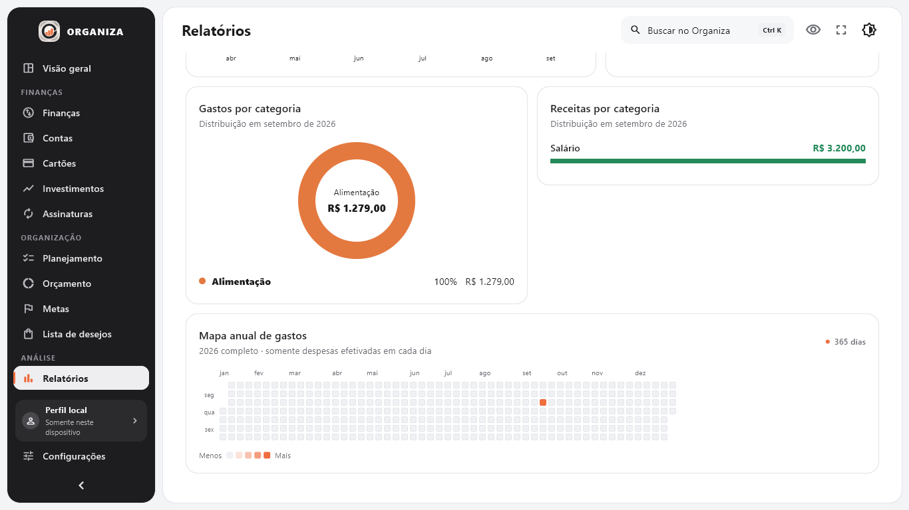
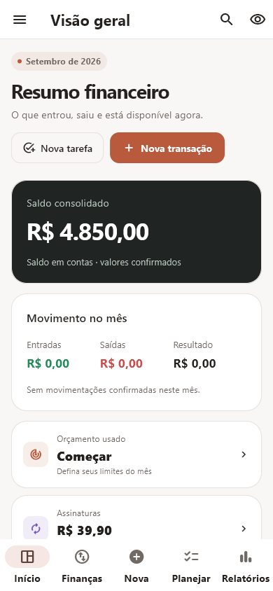
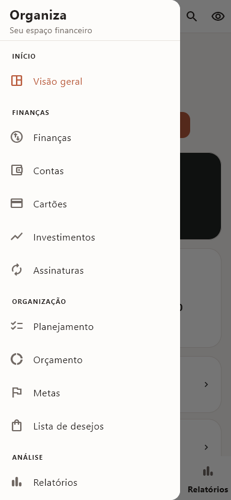
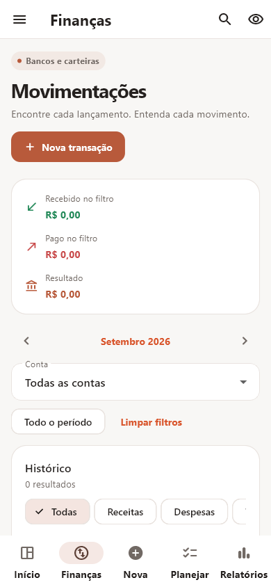

<p align="center">
  
</p>

<h1 align="center">Organiza</h1>

<p align="center">
  Controle financeiro pessoal para Windows e Android, privado por padrão e funcional sem internet.
</p>

<p align="center">
  
  
  
  
  
  
  
</p>

## 🧭 Sobre o projeto

O **Organiza** reúne contas, lançamentos, cartões, orçamentos, assinaturas, investimentos, planejamento salarial, metas e relatórios em uma experiência adaptada ao desktop e ao celular. O aplicativo foi desenhado para tornar a situação financeira compreensível em poucos segundos, sem depender de login, nuvem ou serviços bancários externos.

> **Local-first:** os dados financeiros permanecem no próprio dispositivo, em uma base SQLite local. O aplicativo não inclui telemetria, analytics ou sincronização automática. Os dados do Windows e do Android são separados; instalar o app no celular não transfere automaticamente a base do computador.

> [!IMPORTANT]
> **Transparência sobre IA:** este projeto foi desenvolvido com apoio de ferramentas de inteligência artificial na pesquisa, concepção visual, implementação, testes e documentação. A direção do produto e a publicação são humanas. O aplicativo distribuído não incorpora modelos de IA e não envia dados financeiros para serviços de IA.

## ✨ Destaques

### Novo na versão 0.7.0

- **Visão geral orientada à ação:** evolução interativa de seis meses, pendências ordenadas por vencimento, previsão de fechamento e categorias próximas do limite.
- **Pagamentos com controle:** confirmação de pagamento/recebimento com opção de desfazer; edição de valor e descrição de uma ocorrência sem recriar o lançamento.
- **Histórico contextual:** filtros de mês, conta, tipo, status e texto; ordenação por data ou valor; os totais acompanham os filtros e consideram apenas valores confirmados.
- **Experiência revisada:** cards de contas, primeiro acesso guiado, calendário recolhível, contraste corrigido nos filtros, navegação adaptável a janelas menores e linhas de transação legíveis no celular.
- **Preferências que permanecem:** tema e ocultação de valores são salvos; seletores de data e componentes nativos usam português do Brasil.

### Recursos do Organiza

- **Fluxo financeiro real e planejado:** receitas, despesas e transferências, com lançamentos únicos, recorrentes ou parcelados, descrição opcional e controle de pago/pendente. O salário recorrente só cria cada ocorrência quando chega o dia.
- **Organização flexível:** categorias e subcategorias personalizáveis, filtros, busca e identificação visual das contas bancárias.
- **Cartões e compromissos:** limite, ciclo, fatura atual, compras parceladas, calendário de vencimentos e assinaturas editáveis ou pausáveis.
- **Patrimônio e objetivos:** carteira de investimentos por classe, renda fixa por tipo/emissor/vencimento, taxa manual ao mês ou ao ano, dia de crédito do rendimento, valor atual editável, planejamento salarial e metas com categorias próprias.
- **Análise visual:** evolução mensal, entradas versus saídas, pizza interativa de gastos por categoria, ranking, exportação CSV e mapa anual.
- **Experiência desktop:** temas claro e escuro, ocultação de valores, animações sutis, atalhos de teclado e tela cheia.
- **Compras conscientes:** lista de desejos com quantidade, prioridade, valor estimado, itens comprados e exclusão; tarefas também podem ser excluídas com confirmação.

## 🖥️ Visão do produto

<p align="center">
  
</p>

<table>
  <tr>
    <td width="50%"></td>
    <td width="50%"></td>
  </tr>
  <tr>
    <td align="center"><strong>Lançamentos organizados</strong></td>
    <td align="center"><strong>Carteira consolidada</strong></td>
  </tr>
  <tr>
    <td></td>
    <td></td>
  </tr>
  <tr>
    <td align="center"><strong>Controle de cartões</strong></td>
    <td align="center"><strong>Relatórios visuais</strong></td>
  </tr>
</table>

<details>
  <summary><strong>Ver mais telas</strong></summary>
  <br>
  <p align="center">
    
    
    
    
    
    
    
    
    
    
    
  </p>
  <p align="center">
    
    
    
  </p>
</details>

## 🧩 Módulos

| Área | O que oferece |
|---|---|
| 📊 Visão geral | Saldo consolidado, movimento mensal, calendário de pagamentos, assinaturas e ações rápidas |
| 💸 Finanças | Histórico, busca, filtros, categorias, subcategorias, recorrência, parcelamento e baixa de pendências |
| 🏦 Contas | Saldo por conta, cadastro, ajuste do saldo atual e identificação de instituições financeiras |
| 💳 Cartões | Limite, fechamento, vencimento, ciclo, fatura atual e compras parceladas |
| 🎯 Planejamento e orçamento | Salário apenas da categoria Salário, distribuição ajustável e limites mensais por categoria, inclusive novas categorias |
| 📈 Investimentos | Total aplicado, valor atual, variação acumulada, taxa e dia de crédito informados, edição, alocação e renda fixa |
| 🔁 Assinaturas | Compromissos mensais por valor, vencimento e categoria; edição, pausa e reativação |
| 🏁 Metas | Objetivo, categoria personalizada, prazo, valor acumulado, aportes e progresso |
| 🛍️ Lista de desejos | Planejamento de compras sem alterar o saldo financeiro |
| 📉 Relatórios | Mês selecionável, realizado versus previsto, tendências, pizza interativa, mapa anual e exportação CSV |

## 🚀 Primeiros passos

### ✅ Android: instalar o aplicativo

[Baixe o APK Android 0.7.0](https://github.com/danielcdesk/Organiza/releases/download/v0.7.0/Organiza-Android-0.7.0.apk), copie-o para o celular e abra-o pelo gerenciador de arquivos. O Android pode pedir autorização para instalar apps dessa origem. Após a instalação, abra **Organiza**; não é necessário criar conta nem ter internet. Atualizações usam a mesma chave de release.

O APK contém todos os módulos, com menu lateral dividido por áreas, quatro atalhos configuráveis em Configurações e botão central de nova transação. Esta versão foi compilada para Android; **não há pacote iOS**, pois a compilação e assinatura para iPhone exigem macOS e a toolchain da Apple.

### ✅ Windows: baixar e executar

[Baixe o pacote Windows 0.7.0](https://github.com/danielcdesk/Organiza/releases/download/v0.7.0/Organiza-Windows-0.7.0.zip), extraia a pasta inteira e abra `organiza.exe`. Não mova apenas o executável: os arquivos distribuídos ao lado dele são necessários.

### ✅ Requisitos para desenvolver

- Windows 10 ou 11;
- [Flutter](https://docs.flutter.dev/get-started/install/windows/desktop) com suporte a Windows Desktop;
- toolchain de compilação Windows reconhecida pelo `flutter doctor`.
- Para compilar Android: JDK 17, Android SDK e licenças aceitas no `flutter doctor`.

### ▶️ Executar localmente

```powershell
git clone https://github.com/danielcdesk/Organiza.git
cd Organiza
flutter pub get
flutter run -d windows
```

Para iniciar no Android, conecte um aparelho com depuração USB e use `flutter run -d <id-do-dispositivo>`.

### 📦 Gerar o executável

```powershell
flutter build windows --release
```

O resultado será criado em `build/windows/x64/runner/Release/`. O executável depende dos arquivos gerados ao lado dele; distribua a pasta `Release` completa.

Para gerar um APK de release, configure `ORGANIZA_KEYSTORE_PATH` e `ORGANIZA_SIGNING_PASSWORD` no ambiente com sua própria chave privada e execute `flutter build apk --release`. A chave de assinatura **não deve ser enviada ao GitHub**. Sem essas variáveis, o projeto não assina automaticamente o APK de release.

## 🧪 Qualidade e testes

```powershell
dart analyze
flutter test
flutter test integration_test -d windows
```

Na versão 0.7.0, a previsão do dashboard usa o saldo atual e as receitas/despesas pendentes registradas até o fim do mês, incluindo atrasos. Transferências não alteram a previsão consolidada. Assinaturas, faturas e salários ainda não lançados não entram nesse cálculo. A edição de lançamentos altera somente a ocorrência selecionada, preservando as próximas parcelas e recorrências.

A taxa de investimento informada pelo usuário continua separada da variação acumulada simples. Não há crédito automático de rendimentos ou consulta de cotações. O salário recorrente gera uma ocorrência pendente no dia cadastrado, para confirmação manual.

Validação da versão 0.7.0: análise estática e **41 testes Flutter** aprovados, cobrindo previsão, edição, desfazer, filtros, preferências, migrações e navegação móvel. Consulte as [notas da versão](docs/releases/v0.7.0.md) para evidências dos pacotes. A validação do layout compacto no Windows não substitui instalação e teste em Android físico.

Consulte o [estado conhecido como bom](docs/known_good_state.md) e a [estratégia de testes](docs/testing_strategy.md) para os contratos de regressão.

Para navegar por todas as decisões, regras e notas de release, consulte o [índice da documentação](docs/README.md).

## 🏗️ Arquitetura

```text
presentation  →  application  →  data/database
       ↓               ↓              ↓
    widgets       casos de uso      SQLite
                       ↓
                    domain
```

- Valores monetários são armazenados como centavos inteiros.
- Widgets não executam SQL diretamente.
- Lançamentos pendentes aparecem no planejamento, mas não alteram o saldo realizado.
- Migrações preservam bases criadas pelas versões anteriores.

```text
lib/
├── application/   # estado e casos de uso
├── core/          # constantes compartilhadas
├── data/          # repositório local
├── database/      # schema, migrações e consultas SQLite
├── domain/        # entidades e regras financeiras puras
├── presentation/  # páginas, diálogos, tema e componentes
└── services/      # exportação e fronteiras de backup

docs/              # decisões, regras, qualidade e capturas
integration_test/  # fluxo desktop completo
test/              # regressões de domínio, banco e interface
tooling/           # preparação reproduzível de ativos
windows/           # runner nativo do Flutter
```

## ⌨️ Atalhos

| Atalho | Ação |
|---|---|
| `Ctrl + K` | Abrir a busca local |
| `Ctrl + N` | Criar lançamento |
| `Ctrl + Shift + N` | Criar tarefa |
| `Ctrl + ,` | Abrir configurações |
| `F11` | Alternar tela cheia |

## 🔐 Privacidade e segurança

- Nenhum dado financeiro é enviado pelo aplicativo.
- O cartão armazena somente nome, bandeira, limite, vencimento, fechamento e quatro últimos dígitos — nunca número completo ou CVV.
- Bancos de dados, backups, exportações, arquivos `.env`, logs e artefatos de build estão protegidos pelas regras do `.gitignore`.
- Não há recomendação de investimento, conexão com corretora ou execução de ordens.

## 📚 Documentação

- [Arquitetura](docs/architecture.md)
- [Regras financeiras](docs/financial_rules.md)
- [Matriz de funcionalidades](docs/feature_matrix.md)
- [Base de pesquisa funcional](docs/research_basis.md)
- [Registro de mudanças](docs/change_log.md)
- [Base de conhecimento de erros](docs/error_knowledge_base.md)

## 🗺️ Roadmap

- pagamento e histórico definitivo de faturas;
- edição de categorias, datas e limites de orçamentos;
- baixa e alteração de séries recorrentes em lote;
- backup e restauração com confirmação;
- importação de extratos e notas;
- integração bancária e cotações somente mediante arquitetura explícita de consentimento e privacidade.

## ⚖️ Avisos e transparência

Os nomes e logotipos de instituições financeiras são usados apenas para identificação visual e pertencem aos seus respectivos titulares. Este projeto não possui vínculo oficial com essas instituições.

O uso de IA neste projeto está declarado de forma intencional: ferramentas de inteligência artificial participaram do processo de desenvolvimento, revisão e documentação. O produto final, porém, não contém IA, LLM, analytics ou integração externa em tempo de execução.
