<p align="center">
  
</p>

<h1 align="center">Organiza</h1>

<p align="center">
  Controle financeiro pessoal para Windows, privado por padrão e funcional sem internet.
</p>

<p align="center">
  
  
  
  
  
  
</p>

## 🧭 Sobre o projeto

O **Organiza** reúne contas, lançamentos, cartões, orçamentos, assinaturas, investimentos, planejamento salarial, metas e relatórios em uma experiência desktop única. O aplicativo foi desenhado para tornar a situação financeira compreensível em poucos segundos, sem depender de login, nuvem ou serviços bancários externos.

> **Local-first:** os dados financeiros permanecem no computador do usuário, em uma base SQLite local. O aplicativo não inclui telemetria, analytics ou sincronização automática.

> [!IMPORTANT]
> **Transparência sobre IA:** este projeto foi desenvolvido com apoio de ferramentas de inteligência artificial na pesquisa, concepção visual, implementação, testes e documentação. A direção do produto e a publicação são humanas. O aplicativo distribuído não incorpora modelos de IA e não envia dados financeiros para serviços de IA.

## ✨ Destaques

- **Fluxo financeiro real e planejado:** receitas, despesas e transferências, com lançamentos únicos, recorrentes ou parcelados e controle de pago/pendente.
- **Organização flexível:** categorias e subcategorias personalizáveis, filtros, busca e identificação visual das contas bancárias.
- **Cartões e compromissos:** limite, ciclo, fatura atual, compras parceladas, orçamentos mensais e assinaturas recorrentes.
- **Patrimônio e objetivos:** carteira de investimentos por classe, renda fixa por tipo/emissor/vencimento, planejamento salarial e metas com aportes.
- **Análise visual:** evolução mensal, entradas versus saídas, distribuição por categoria, ranking de gastos, exportação CSV e mapa anual.
- **Experiência desktop:** temas claro e escuro, ocultação de valores, animações sutis, atalhos de teclado e tela cheia.
- **Compras conscientes:** lista de desejos com quantidade, prioridade, valor estimado, itens comprados e exclusão; tarefas também podem ser excluídas com confirmação.

## 🖥️ Visão do produto

<p align="center">
  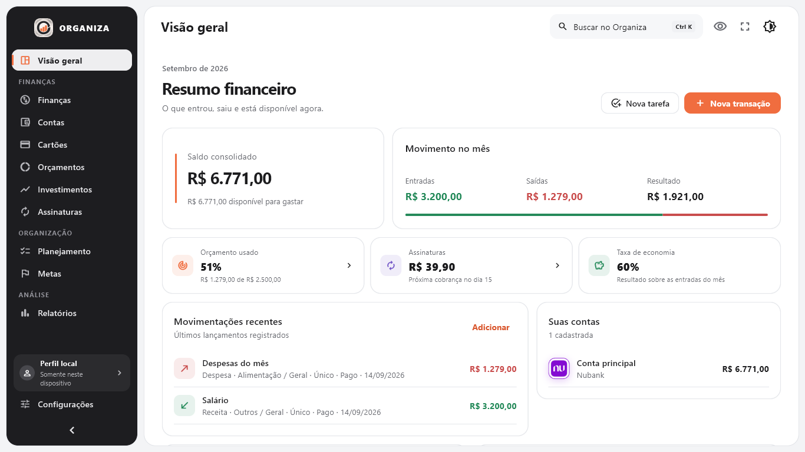
</p>

<table>
  <tr>
    <td width="50%">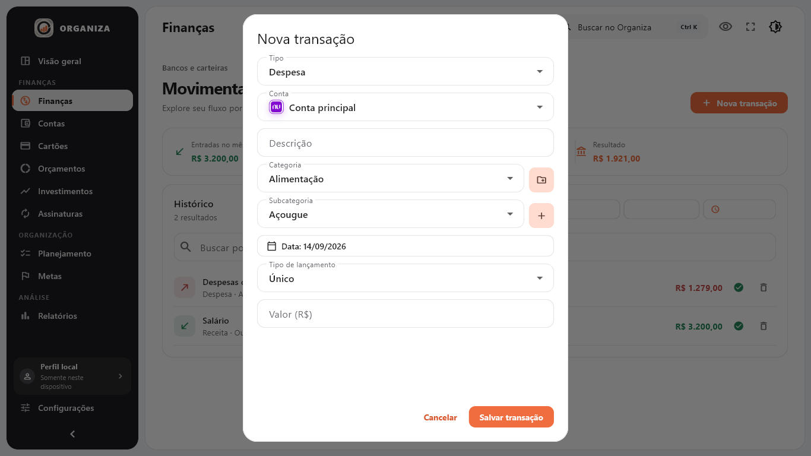</td>
    <td width="50%">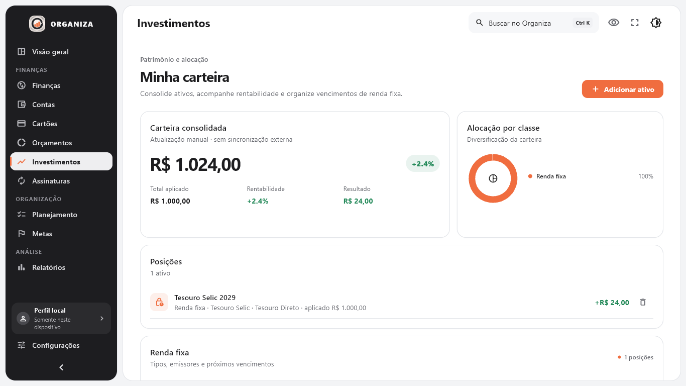</td>
  </tr>
  <tr>
    <td align="center"><strong>Lançamentos organizados</strong></td>
    <td align="center"><strong>Carteira consolidada</strong></td>
  </tr>
  <tr>
    <td>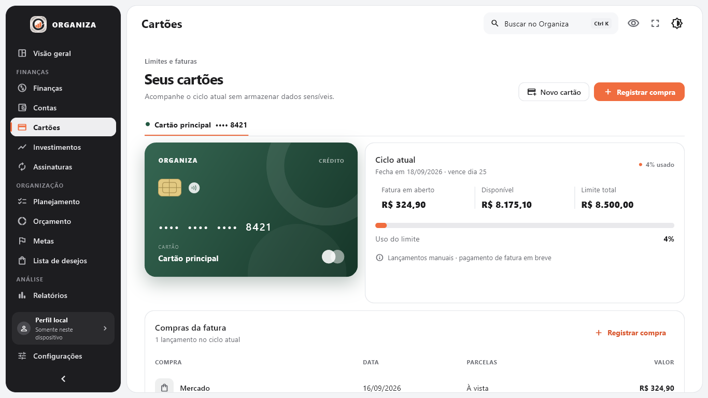</td>
    <td>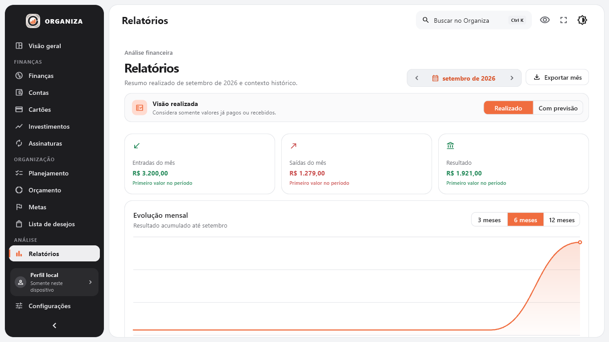</td>
  </tr>
  <tr>
    <td align="center"><strong>Controle de cartões</strong></td>
    <td align="center"><strong>Relatórios visuais</strong></td>
  </tr>
</table>

<details>
  <summary><strong>Ver mais telas</strong></summary>
  <br>
  <p align="center">
    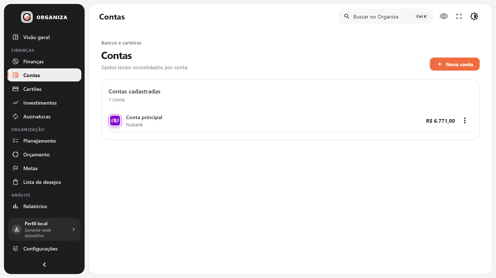
    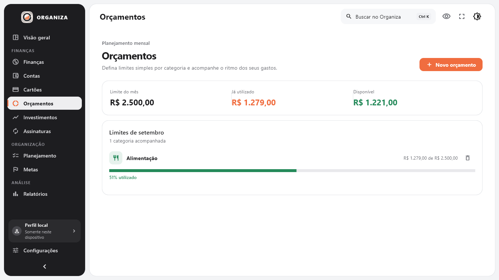
    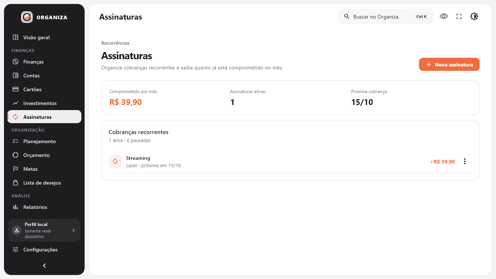
    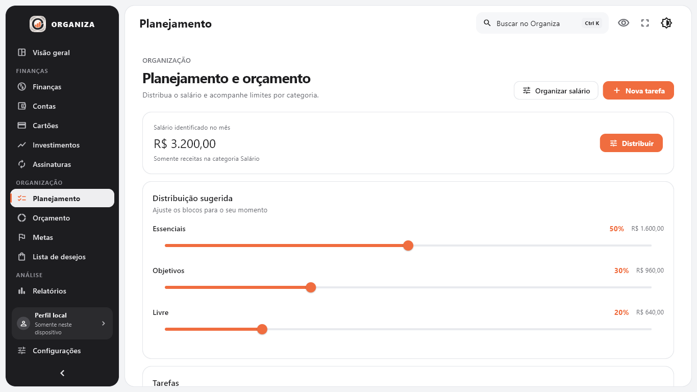
    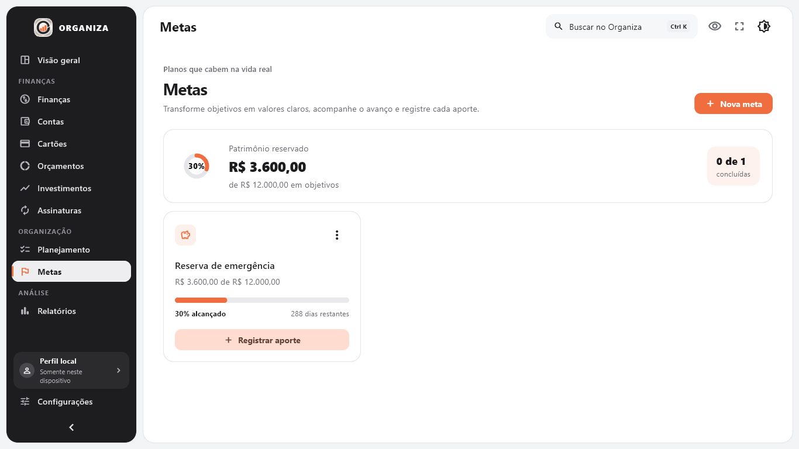
    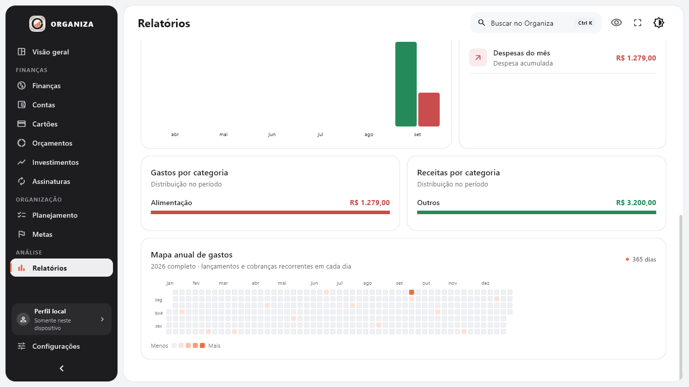
    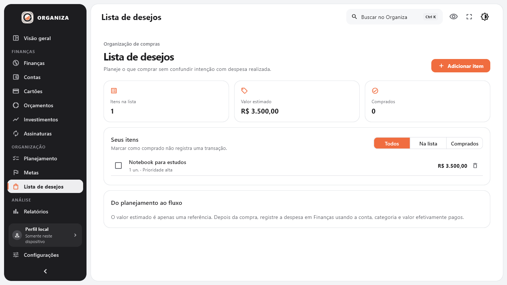
  </p>
</details>

## 🧩 Módulos

| Área | O que oferece |
|---|---|
| 📊 Visão geral | Saldo consolidado, movimento mensal, orçamento, assinaturas, economia e ações rápidas |
| 💸 Finanças | Histórico, busca, filtros, categorias, subcategorias, recorrência, parcelamento e baixa de pendências |
| 🏦 Contas | Saldo por conta, cadastro e identificação de instituições financeiras |
| 💳 Cartões | Limite, fechamento, vencimento, ciclo, fatura atual e compras parceladas |
| 🎯 Orçamentos | Limites mensais por categoria e acompanhamento do consumo realizado |
| 📈 Investimentos | Patrimônio, rentabilidade, resultado, alocação e organização de renda fixa |
| 🔁 Assinaturas | Compromissos mensais por valor, vencimento e categoria |
| 🗂️ Planejamento | Salário identificado e distribuição ajustável entre essenciais, objetivos e livre |
| 🏁 Metas | Objetivo, prazo, valor acumulado, aportes e progresso |
| 🛍️ Lista de desejos | Planejamento de compras sem alterar o saldo financeiro |
| 📉 Relatórios | Mês selecionável, realizado versus previsto, tendências, categorias, mapa anual e exportação CSV |

## 🚀 Primeiros passos

### ✅ Requisitos

- Windows 10 ou 11;
- [Flutter](https://docs.flutter.dev/get-started/install/windows/desktop) com suporte a Windows Desktop;
- toolchain de compilação Windows reconhecida pelo `flutter doctor`.

### ▶️ Executar localmente

```powershell
git clone https://github.com/danielcdesk/Organiza.git
cd Organiza
flutter pub get
flutter run -d windows
```

### 📦 Gerar o executável

```powershell
flutter build windows --release
```

O resultado será criado em `build/windows/x64/runner/Release/`. O executável depende dos arquivos gerados ao lado dele; distribua a pasta `Release` completa.

## 🧪 Qualidade e testes

```powershell
dart analyze
flutter test
flutter test integration_test -d windows
```

Estado verificado da versão 0.4.0:

- análise estática sem problemas;
- 22 testes unitários e de widget aprovados;
- fluxo integrado aprovado no Windows em 1366 × 768;
- build Windows em modo release concluído;
- migração incremental do schema 1 ao 9 coberta por teste;
- capturas das áreas principais revisadas visualmente.

Consulte o [estado conhecido como bom](docs/known_good_state.md) e a [estratégia de testes](docs/testing_strategy.md) para os contratos de regressão.

## 🏗️ Arquitetura

```text
presentation  →  application  →  data/database
       ↓               ↓              ↓
    widgets       casos de uso      SQLite
                       ↓
                    domain
```

- Valores monetários são armazenados como centavos inteiros.
- Widgets não executam SQL diretamente.
- Lançamentos pendentes aparecem no planejamento, mas não alteram o saldo realizado.
- Migrações preservam bases criadas pelas versões anteriores.

```text
lib/
├── application/   # estado e casos de uso
├── core/          # constantes compartilhadas
├── data/          # repositório local
├── database/      # schema, migrações e consultas SQLite
├── domain/        # entidades e regras financeiras puras
├── presentation/  # páginas, diálogos, tema e componentes
└── services/      # exportação e fronteiras de backup

docs/              # decisões, regras, qualidade e capturas
integration_test/  # fluxo desktop completo
test/              # regressões de domínio, banco e interface
tooling/           # preparação reproduzível de ativos
windows/           # runner nativo do Flutter
```

## ⌨️ Atalhos

| Atalho | Ação |
|---|---|
| `Ctrl + K` | Abrir a busca local |
| `Ctrl + N` | Criar lançamento |
| `Ctrl + Shift + N` | Criar tarefa |
| `Ctrl + ,` | Abrir configurações |
| `F11` | Alternar tela cheia |

## 🔐 Privacidade e segurança

- Nenhum dado financeiro é enviado pelo aplicativo.
- O cartão armazena somente nome, bandeira, limite, vencimento, fechamento e quatro últimos dígitos — nunca número completo ou CVV.
- Bancos de dados, backups, exportações, arquivos `.env`, logs e artefatos de build estão protegidos pelas regras do `.gitignore`.
- Não há recomendação de investimento, conexão com corretora ou execução de ordens.

## 📚 Documentação

- [Arquitetura](docs/architecture.md)
- [Regras financeiras](docs/financial_rules.md)
- [Matriz de funcionalidades](docs/feature_matrix.md)
- [Base de pesquisa funcional](docs/research_basis.md)
- [Registro de mudanças](docs/change_log.md)
- [Base de conhecimento de erros](docs/error_knowledge_base.md)

## 🗺️ Roadmap

- pagamento e histórico definitivo de faturas;
- edição de lançamentos e orçamentos;
- baixa e alteração de séries recorrentes em lote;
- backup e restauração com confirmação;
- importação de extratos e notas;
- versões móveis opcionais;
- integração bancária e cotações somente mediante arquitetura explícita de consentimento e privacidade.

## ⚖️ Avisos e transparência

Os nomes e logotipos de instituições financeiras são usados apenas para identificação visual e pertencem aos seus respectivos titulares. Este projeto não possui vínculo oficial com essas instituições.

O uso de IA neste projeto está declarado de forma intencional: ferramentas de inteligência artificial participaram do processo de desenvolvimento, revisão e documentação. O produto final, porém, não contém IA, LLM, analytics ou integração externa em tempo de execução.
