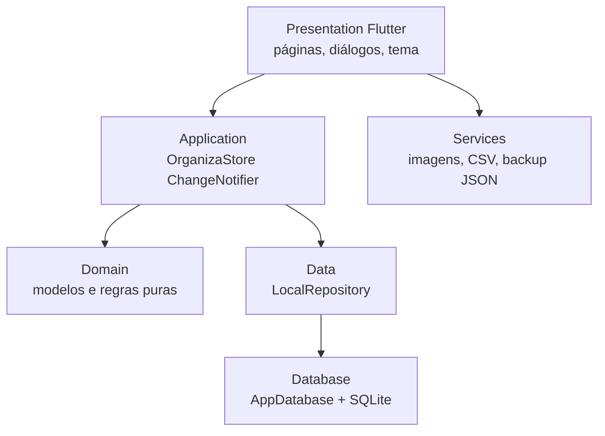

# Dossiê técnico do Organiza

Documento preparado para revisão arquitetural, de qualidade e de evolução do projeto.

**Projeto auditado:** Organiza

**Versão declarada:** `0.7.1+10`

**Data da leitura:** 28/09/2026

**Diretório:** `C:\Users\comoe\OneDrive\Documentos\ChatGPT\Organiza 2\Organiza`

**Plataformas presentes no código:** Windows Desktop e Android
**Objetivo do produto:** controle financeiro pessoal local-first, com dados mantidos no próprio dispositivo.

## 1. Resumo executivo

O Organiza é um aplicativo Flutter escrito em Dart. A mesma base de código atende Windows e Android, com layouts diferentes para desktop e celular. A aplicação não possui servidor, API, login remoto, sincronização, telemetria ou integração bancária em tempo de execução. Os dados financeiros são gravados em SQLite local e os valores monetários são representados em centavos inteiros.

A solução usa uma arquitetura em camadas:



O núcleo funcional está implementado e possui boa separação inicial entre widgets, estado, regras e persistência. O principal ponto arquitetural é a concentração de muitos casos de uso em dois arquivos grandes: `lib/application/organiza_store.dart` e `lib/database/app_database.dart`. Essa escolha é simples para um produto local pequeno, mas aumenta o custo de manutenção, revisão e evolução simultânea de vários módulos.

## 2. Stack e dependências

### Linguagens e frameworks

| Camada | Tecnologia | Uso no projeto |
|---|---|---|
| Aplicação | Dart `3.13.4` | Modelos, regras, estado, widgets e serviços |
| UI multiplataforma | Flutter `3.47.5` stable | Renderização de Windows e Android |
| UI | Material 3 | Tema, formulários, diálogos, navegação e componentes |
| Desktop | Flutter Windows + Win32 runner em C++ | Executável `Organiza.exe` |
| Mobile | Flutter Android + Kotlin | APK com `FlutterActivity` |
| Persistência | SQLite via pacote `sqlite3` | Banco local, SQL e migrações |
| Arquivos | `path_provider`, `path`, `file_picker` | Diretórios privados, seleção e cópia de imagens |
| Identidade local | `uuid` | IDs de contas, lançamentos, cartões e demais entidades |
| Ícones vetoriais | `flutter_svg` | Ícones SVG inline com semântica |
| Janela Windows | `window_manager` | Tamanho inicial, foco, centralização e tela cheia |

### Dependências declaradas em `pubspec.yaml`

```yaml
sqlite3: ^3.5.2
path: ^1.9.0
path_provider: ^2.1.4
uuid: ^4.5.0
window_manager: ^0.5.2
flutter_svg: ^2.0.17
file_picker: ^8.3.7
```

Dependências de desenvolvimento:

```yaml
flutter_test
integration_test
flutter_lints: ^6.0.0
```

O projeto fixa um override para `flutter_plugin_android_lifecycle` `2.0.20`, documentado como uma decisão de compatibilidade com o ciclo de vida do picker Android usado nesta toolchain.

### Android

- Namespace e `applicationId`: `com.danielcdesk.organiza`.
- Gradle em Kotlin DSL (`*.gradle.kts`).
- Android Gradle Plugin declarado como `9.1.0`.
- Kotlin declarado como `2.4.0`.
- Java/Kotlin target: JVM 17.
- `compileSdk = 36`.
- `minSdk` segue o Flutter instalado; o AAB desta revisão foi verificado com `compileSdk 36`, `targetSdk 36` e `versionCode 10` no manifesto final.
- Activity nativa: `MainActivity.kt`, uma subclasse direta de `FlutterActivity`.
- O manifesto declara o rótulo `Organiza`, ícone launcher e inicialização padrão do Flutter.

### Windows

- Runner nativo padrão do Flutter baseado em C++/Win32.
- Ícone do executável em `windows/runner/resources/app_icon.ico`.
- Metadados do executável são definidos em `windows/runner/Runner.rc`.
- `main.dart` usa `window_manager` para abrir a janela em `1440×900`, com mínimo de `960×640`.

## 3. Inicialização e ciclo de vida

O fluxo de entrada é:

1. `lib/main.dart` chama `WidgetsFlutterBinding.ensureInitialized()`.
2. Em Windows, inicializa o `window_manager`, configura a janela e mostra/foca o processo.
3. `OrganizaStore.create()` abre o `LocalRepository` e, por baixo dele, o `AppDatabase`.
4. O banco abre ou cria `%LOCALAPPDATA%/Organiza/organiza.db` no Windows e executa as migrações. Na primeira abertura após a atualização, a base antiga em `%APPDATA%` é copiada junto com seus sidecars quando necessário.
5. O store carrega todas as coleções em memória e materializa salários recorrentes já vencidos.
6. `runApp(OrganizaApp(store: store))` inicia o MaterialApp em pt-BR.
7. `OrganizaShell` verifica `profileName`. Se estiver vazio, mostra `ProfileSetupPage`; caso contrário, abre o painel.
8. O store agenda uma atualização no início de cada novo dia para materializar novas ocorrências salariais.

O encerramento do store cancela o timer diário, fecha o repositório e fecha a conexão SQLite.

## 4. Arquitetura por camada

### Presentation

Está em `lib/presentation/`. Os widgets recebem uma instância de `OrganizaStore` por construtor. A navegação fica concentrada em `OrganizaShell`, que seleciona a página ativa e repassa ações para o store.

- `organiza_app.dart`: `MaterialApp`, seleção de tema, shell desktop/mobile, sidebar, drawer, navegação inferior, busca global, atalhos de teclado, tela cheia, confirmação de exclusões, abertura de diálogos, primeiro acesso e exportação.
- `organiza_theme.dart`: temas claro, escuro e ajustes de densidade mobile; esquema Material 3, cores, bordas, cartões, botões, chips e diálogos.
- `organiza_icons.dart`: catálogo de ícones SVG vetoriais usados na navegação, com `semanticsLabel`.
- `shared_widgets.dart`: componentes reutilizáveis como `PageHeading`, `Panel`, `EmptyState`, `IconTile`, `InstitutionMark`, linhas de dados, linhas de lançamento e indicadores de status.
- `dialogs.dart`: formulários de conta, saldo, transação, cartão, compra no cartão, investimento, orçamento, assinatura, meta, aporte, tarefa e perfil.
- `profile_setup_page.dart`: onboarding obrigatório do primeiro uso, com nome, renda mensal e foto local.
- `dashboard_page.dart`: visão geral, saldo, resumo mensal, calendário de pagamentos, compromissos, contas, lançamentos, cartão e tarefas.
- `overview_widgets.dart`: previsão de fechamento, agenda de pendências, gráfico de fluxo, primeiros passos e observação de orçamento.
- `basic_pages.dart`: histórico de transações, contas, planejamento salarial, configurações e estado de recurso futuro.
- `budgets_page.dart`: consumo e limites mensais por categoria.
- `cards_page.dart`: cartões, ciclo, fatura atual, limite, compras e parcelas.
- `investments_page.dart`: carteira manual, telemetria visual animada, alocação, posições e renda fixa.
- `goals_page.dart`: metas, progresso e aportes.
- `reports_page.dart`: seleção de mês, realizado/previsto, métricas, tendência, pizza de categorias, ranking e mapa anual.
- `shopping_page.dart`: lista de desejos em modo lista ou cards, quantidade, prioridade, preço, descrição, imagem e baixa.
- `subscriptions_page.dart`: compromissos mensais ativos, pausa, reativação e edição.

O layout é responsivo por largura: abaixo de 600 px usa AppBar, Drawer e NavigationBar; acima disso usa sidebar e área de conteúdo. O desktop também suporta `Ctrl+K`, `Ctrl+N`, `Ctrl+Shift+N`, `Ctrl+,` e `F11`.

### Application

`lib/application/organiza_store.dart` contém `OrganizaStore`, um `ChangeNotifier` que funciona como estado global e camada de casos de uso.

Responsabilidades atuais:

- manter listas carregadas de todas as entidades;
- ler e salvar preferências;
- validar entradas de alto nível;
- gerar IDs UUID;
- criar, atualizar e excluir entidades;
- criar séries recorrentes e parcelas;
- materializar salários no dia de vencimento;
- calcular saldos e totais delegando ao domínio;
- recarregar o estado completo após cada mutação;
- notificar a UI com `notifyListeners()`;
- fornecer `create()` para banco persistente e `inMemory()` para testes.

O estado é compartilhado por composição: não há Provider, Riverpod, Bloc ou outro contêiner de dependência. A injeção é manual pelo construtor.

### Domain

`lib/domain/` não importa Flutter. Contém modelos imutáveis com construtores `const`, enums e regras financeiras puras.

- `models.dart`: entidades e enums do produto.
- `financial_rules.dart`: saldo por conta, saldo consolidado, totais mensais, validação de valores, orçamento consumido e formatação BRL.
- `cash_flow_summary.dart`: previsão do fechamento do mês com pendências vencidas e futuras, excluindo transferências.
- `credit_card_rules.dart`: ciclo, parcela corrente, fatura atual, saldo comprometido, limite disponível e proporção de uso.
- `investment_rules.dart`: total aplicado, saldo atual, lucro, retorno acumulado e participação na carteira.

### Data

`lib/data/local_repository.dart` é uma fachada fina. A UI e o store não importam `sqlite3`; o repositório encaminha leituras e gravações para `AppDatabase`.

### Database

`lib/database/app_database.dart` é a única classe que conhece SQL. Ela abre o SQLite, ativa `PRAGMA foreign_keys = ON`, `busy_timeout`, WAL e `synchronous=NORMAL` no banco persistente, mantém `PRAGMA user_version`, executa migrações incrementais, converte linhas para modelos e expõe operações de leitura/escrita.

O banco persistente fica no diretório privado de suporte da aplicação, separado por plataforma. O banco de Windows não é sincronizado automaticamente com o banco do Android.

### Services

- `local_image_service.dart`: seleciona imagem com `file_picker`, aceita extensões de imagem comuns até 10 MB, copia para a pasta privada da aplicação, gera nome UUID e oferece verificação de existência.
- `report_export_service.dart`: exporta lançamentos para CSV local com separador `;`, BOM UTF-8 compatível com Excel, escape de aspas e filtro opcional por período.
- `backup_service.dart`: exporta JSON compatível, cria envelopes AES-256-GCM com chave derivada por Argon2id, valida hash/autenticidade e descriptografa antes da restauração transacional. As configurações exibem ações para criar e restaurar o backup; antes da restauração é guardada uma cópia protegida do estado atual.

## 5. Modelo de domínio

### Entidades persistidas

| Entidade | Campos principais | Uso |
|---|---|---|
| `Account` | nome, saldo inicial em centavos, instituição, nome/ícone customizado | Conta bancária ou carteira |
| `TransactionRecord` | conta, destino opcional, tipo, valor, data, categoria, subcategoria, série, parcela, status | Receita, despesa ou transferência |
| `TaskItem` | título, vencimento opcional, concluída | Tarefas do planejamento/dashboard |
| `ShoppingItem` | nome, quantidade, preço, prioridade, comprada, imagem, descrição | Lista de desejos/compras |
| `CreditCard` | nome, bandeira, quatro últimos dígitos, limite, fechamento, vencimento, cor | Cartão e ciclo de fatura |
| `CardPurchase` | cartão, descrição, total, data, parcelas | Compra manual no cartão |
| `InvestmentPosition` | nome, classe, aplicado, atual, renda fixa, emissor, vencimento, taxa e dia de crédito | Carteira manual |
| `Budget` | categoria, limite, ano e mês | Orçamento mensal |
| `Subscription` | nome, valor, cobrança, categoria, ativo | Compromisso recorrente manual |
| `SalarySchedule` | conta, valor, descrição, subcategoria, primeiro vencimento e dia mensal | Série de salário |
| `FinancialGoal` | nome, objetivo, acumulado, prazo, ícone e categoria | Meta com aportes |
| `FinanceCategory` | nome, tipo, sistema/customizada | Categorias de receita/despesa |
| `FinanceSubcategory` | categoria-pai, nome, sistema/customizada | Detalhamento de categorias |
| `SalaryAllocation` | essenciais, objetivos e livre | Preferência percentual que soma 100% |
| `app_settings` | chave e valor textual | Tema, privacidade, perfil e atalhos |

### Enums importantes

- `TransactionType`: `income`, `expense`, `transfer`.
- `TransactionScheduleType`: `single`, `recurring`, `installment`.
- `AccountInstitution`: instituições conhecidas, genérica e customizada. A lista inclui Nubank, Inter, Caixa, Itaú, Bradesco, Santander, Banco do Brasil, Banco PAN, PicPay, Mercado Pago, Neon, Original, Safra, Sicredi, Sicoob, BV, XP e banco customizado.
- `ShoppingPriority`: baixa, normal e alta.
- `CardBrand`: Visa, Mastercard, Elo, Amex e outra.
- `InvestmentType`: renda fixa, ação, fundo, ETF, cripto e outro.
- `FixedIncomeType`: CDB, LCI, LCA, Tesouro Selic/IPCA/Prefixado, debênture, CRI, CRA, poupança e outro.

## 6. Banco SQLite e migrações

O schema atual no código é a versão **15**. As migrações são incrementais e não removem dados históricos.

| Versão | Alteração |
|---:|---|
| 1 | `accounts`, `transactions`, `tasks` e índices básicos |
| 2 | `credit_cards`, `card_purchases` e índice por cartão/data |
| 3 | instituição da conta e tabela `investments` |
| 4 | categoria de transação e `budgets` |
| 5 | subcategoria de transação e `subscriptions` |
| 6 | `salary_allocation` com valores iniciais 50/30/20 |
| 7 | `financial_goals` |
| 8 | recorrência, parcelas, status pago/pendente, detalhes de renda fixa e categorias/subcategorias persistidas |
| 9 | `shopping_items` |
| 10 | taxa manual do investimento e período mensal/anual |
| 11 | dia de crédito, `salary_schedules`, `app_settings`, categoria de metas e índice de séries |
| 12 | imagem da lista de desejos |
| 13 | nome e ícone customizados para instituição da conta |
| 14 | descrição da lista de desejos |
| 15 | índice único para impedir duas ocorrências da mesma série na mesma data |

Constraints e índices relevantes:

- `foreign_keys` está habilitado.
- Valores monetários têm constraints de positividade ou não negatividade conforme o caso.
- Dias de fechamento e vencimento de cartão ficam entre 1 e 28.
- Parcelas ficam entre 1 e 48 no cartão e entre 2 e 60 em lançamentos parcelados.
- Orçamento tem unicidade por categoria, ano e mês.
- Categoria/subcategoria têm unicidade sem diferenciação de maiúsculas/minúsculas.
- O banco mantém índices por data de transação, conta, cartão, investimento, assinatura, meta, série e estado da lista de desejos.
- Séries possuem unicidade parcial por `(series_id, occurred_on)` quando `series_id` não é nulo.
- A migração 15 preserva a primeira linha de uma duplicata antiga antes de criar o índice único, evitando que uma base criada por uma versão com bug deixe de abrir.

O projeto também oferece `AppDatabase.openInMemory()` e um banco em memória que começa na versão 1, usado para testar a cadeia de migração até a versão atual.

## 7. Regras financeiras implementadas

- Todos os valores são centavos inteiros. A formatação para reais acontece somente na apresentação.
- Saldo da conta = saldo inicial + receitas pagas − despesas pagas − transferências enviadas + transferências recebidas.
- Saldo consolidado soma os saldos das contas e não duplica transferências próprias.
- Totais mensais consideram data, tipo e somente lançamentos confirmados.
- Lançamentos pendentes aparecem no planejamento, mas não alteram o saldo realizado.
- A previsão de fechamento soma receitas pendentes e desconta despesas pendentes até o fim do mês, incluindo atrasados e excluindo transferências.
- Lançamento único cria uma ocorrência.
- Lançamento recorrente cria ocorrências mensais do mesmo valor.
- Lançamento parcelado divide o total em centavos, distribuindo o resto nas primeiras parcelas para preservar exatamente o valor informado.
- Salário recorrente é tratado como série própria. A ocorrência é criada pendente no dia devido e pode ser cancelada sem apagar histórico anterior.
- Ajustar o saldo atual recalcula o saldo inicial pela diferença e preserva o histórico de movimentações.
- Orçamento soma despesas confirmadas da categoria no mesmo mês. O indicador visual é limitado a 100%, mas o valor excedente continua explícito.
- Cartão guarda apenas quatro últimos dígitos; nunca armazena número completo, CVV ou senha.
- Fatura atual é a soma das parcelas da compra no ciclo atual. Pagamento definitivo e histórico de faturas ainda não existem.
- Investimento é uma posição manual: o usuário informa aplicado e atual. O retorno é uma variação acumulada simples; taxa cadastrada e dia de crédito são informativos e não geram rendimento automático.
- Distribuição salarial considera a categoria `Salário` e precisa totalizar exatamente 100%.
- Lista de desejos não altera o saldo financeiro quando o item é marcado como comprado.

## 8. Módulos de produto

### Visão geral

Dashboard consolidado com saldo, resumo mensal, previsão, agenda de pendências, calendário de pagamentos, compromissos, contas, últimos lançamentos, cartões e tarefas. A área de fluxo usa `CashFlowSummary` para separar realizado de previsto.

### Finanças

Histórico filtrável por mês, conta, tipo, status e texto. Permite receitas, despesas, transferências, recorrências, parcelamentos, edição de ocorrência, confirmação/desfazer e exclusão com confirmação. Categorias e subcategorias podem ser criadas pelo usuário.

### Contas

Cadastro de conta com saldo inicial, instituição visual e ícone. A conta pode usar bancos conhecidos, marcador genérico ou banco personalizado com nome e ícone escolhido. O saldo atual pode ser ajustado sem excluir movimentações.

### Cartões

Cadastro do cartão com nome, bandeira, quatro últimos dígitos, limite, fechamento e vencimento. Compras podem ser parceladas. A tela calcula ciclo corrente, valor da fatura aberta, saldo comprometido, limite disponível e proporção de uso.

### Organização e orçamento

O menu unifica planejamento salarial e orçamentos. Há distribuição do salário em três blocos, orçamento por categoria/mês, criação de categorias e visualização do consumo.

### Investimentos

Carteira manual por classe, total aplicado, saldo atual, lucro, percentual acumulado, alocação visual e posições de renda fixa. Campos de taxa e dia de crédito são armazenados como informação declarada pelo usuário. Não há cotação, corretora, ordens ou projeção automática.

### Assinaturas

Compromissos recorrentes manuais com valor, dia, categoria, edição e estado ativo/pausado. Assinaturas não geram lançamentos financeiros automaticamente nesta versão.

### Metas

Metas com objetivo, acumulado, prazo, categoria e ícone. O usuário pode registrar aportes; o valor é limitado ao objetivo.

### Relatórios

Mês selecionável, comparação com o mês anterior, 3/6/12 meses, modo realizado/previsto, evolução, entrada versus saída, pizza interativa por categoria, ranking, tendências, mapa anual e CSV local.

### Lista de desejos

Modo lista ou cards, nome, quantidade, prioridade, preço estimado, total estimado, descrição, imagem local, marcação de compra e exclusão.

### Preferências e perfil

Tema claro/escuro/sistema, ocultação de valores, atalhos móveis, tela cheia e perfil local com nome, renda e foto. O primeiro perfil é exigido antes de abrir o painel. Não existe autenticação remota.

## 9. Fluxos de dados principais

### Criar transação

1. A página abre `TransactionDialog`.
2. O diálogo produz `TransactionInput` com tipo, conta, valor, categoria, data e agenda.
3. `OrganizaShell` chama `OrganizaStore.addTransaction`.
4. O store valida valor, contas, destino, quantidade e regras de salário.
5. Para recorrência/parcelamento, gera uma série UUID e várias ocorrências.
6. Cada ocorrência é gravada pelo repositório no SQLite.
7. O store recarrega as listas e notifica todos os widgets.

### Calcular saldo

1. A UI lê `store.balance`.
2. O store delega para `FinancialRules.currentBalance`.
3. A regra percorre contas e lançamentos confirmados.
4. Transferências são aplicadas uma vez na origem e uma vez no destino, sem alterar o total consolidado.

### Materializar salário

1. `reload()` carrega séries salariais.
2. `_materializeDueSalaries()` percorre os meses até a data atual.
3. Se a competência ainda não existir, cria um lançamento pendente ligado ao `seriesId`.
4. O planejamento consegue mostrar o esperado, enquanto o saldo continua considerando somente o confirmado.

### Imagem local

1. `FilePicker` seleciona uma imagem.
2. `LocalImageService` copia o conteúdo para a pasta privada `Organiza/images`.
3. O caminho absoluto é persistido em `app_settings` ou `shopping_items`.
4. A UI verifica se o arquivo ainda existe antes de criar `FileImage`.

## 10. Privacidade, segurança e limitações operacionais

O produto foi desenhado para não enviar dados financeiros. Não existem clientes HTTP, SDK de analytics, Firebase, Supabase, banco remoto ou login online no runtime.

As limitações atuais são relevantes para uma análise profissional:

- O SQLite e os arquivos JSON/CSV são locais; o SQLite não é criptografado pela aplicação e CSV continua sendo um formato de exportação aberto.
- Foto de perfil e fotos de desejos são copiadas para a pasta privada, com extensões permitidas e limite de 10 MB; ainda não há compressão ou limpeza de órfãos.
- O backup criptografado tem importação, restauração atômica, validação de versão, autenticação AES-GCM e derivação Argon2id; não há merge entre bases nem assinatura por identidade externa.
- A base do Windows e a base do Android são independentes; não há sincronização nem resolução de conflitos.
- O Windows mantém um lock exclusivo em `organiza.lock` para impedir duas instâncias concorrentes gravando a mesma base.
- O nome “perfil” representa um perfil local, não uma conta de usuário com identidade verificável.
- Cartão não armazena dados sensíveis completos, decisão correta para o escopo local.

## 11. Testes e qualidade

### Suíte encontrada

Testes unitários, de banco e de widget estão em `test/`, separados por responsabilidade:

- `unit/domain/`: regras financeiras e projeções.
- `unit/application/`: ações do store.
- `unit/data/`: migrações do banco.
- `unit/services/`: serviços locais.
- `widget/`: telas, diálogos e layout.

O fluxo integrado está em `integration_test/first_use_flow_test.dart` e cobre primeiro uso, dashboard, navegação e layout compacto.

### Verificação realizada durante este levantamento

- Flutter `3.47.5` e Dart `3.13.4` disponíveis no ambiente.
- `flutter analyze`: **aprovado, nenhum problema**.
- `flutter test`: **aprovado, 45 testes**, incluindo backup criptografado, restauração e rollback.
- O teste integrado existe e há registro anterior de execução Windows aprovada, mas não foi reexecutado neste levantamento documental.

### Lacunas de qualidade para investigar

- O workflow `.github/workflows/ci.yml` valida formatação, análise, testes e builds sem assinatura oficial.
- Não há teste de instalação Android físico automatizado.
- Não há golden tests para proteger o visual desktop/mobile.
- Não há benchmark com o volume-alvo de 10.000 transações e 1.000 tarefas.
- A cobertura de acessibilidade está baseada em semântica pontual e testes de presença; não há auditoria automatizada de contraste, leitor de tela ou navegação por teclado em todas as telas.
- A documentação histórica de releases ainda pode citar contagens antigas; o código atual está no schema 15 e a suíte atual tem 45 testes.

## 12. Build, distribuição e organização de artefatos

### Desenvolvimento

```powershell
flutter pub get
flutter run -d windows
flutter run -d <id-do-dispositivo>
```

### Validação

```powershell
flutter analyze
flutter test
flutter test integration_test -d windows
```

### Windows

```powershell
flutter build windows --release
```

O executável fica em `build/windows/x64/runner/Release/`. A pasta inteira precisa ser distribuída porque contém `flutter_windows.dll`, `sqlite3.dll` e outros arquivos de runtime.

### Android

`tooling/build_android_release.ps1` procura o Flutter estável, cria uma chave de teste local quando necessário e gera APK universal, APKs separados por ABI e AAB. Para uma assinatura oficial, devem ser definidos `ORGANIZA_KEYSTORE_PATH` e `ORGANIZA_SIGNING_PASSWORD` fora do repositório.

### Empacotamento

`tooling/package_windows_build.ps1` recebe um identificador de build, copia o release Windows e os APKs para:

```text
builds/local/<build-id>/
builds/github/<build-id>/
```

Também gera instaladores auxiliares para emulador Android, um `LEIA-ME.txt`, copia o AAB para as pastas Android e mantém uma cópia pronta para publicação. Artefatos de build são ignorados pelo Git conforme `.gitignore`.

## 13. Diagnóstico preliminar para o especialista

### Pontos fortes

1. Separação inicial clara entre apresentação, aplicação, domínio, dados, banco e serviços.
2. Regras monetárias em centavos inteiros, com testes de arredondamento e parcelamento.
3. Migrações incrementais, constraints SQLite e teste de migração a partir do schema 1.
4. Escopo local-first coerente: a UI não depende de rede para abrir ou operar.
5. Modelo de primeiro acesso e preferências persistentes já cobertos por testes.
6. Layout desktop/mobile e navegação adaptativa implementados na mesma aplicação.
7. Dados sensíveis de cartão são minimizados por design.

### Prioridade alta

**P0 — Alinhar documentação e fonte.** Atualizar `README`, `docs/architecture.md`, `docs/known_good_state.md`, matriz e release notes para refletirem schema 15, a política de privacidade, o modelo de ameaças e as funcionalidades mais recentes. Incluir um comando de auditoria que confira versão do `pubspec.yaml`, schema e documentação.

**P0 — Definir uma política de backup real.** O fluxo local agora tem snapshot versionado, restauração transacional e backup criptografado. Ainda é necessário conectar a UI de confirmação e decidir se haverá merge ou apenas substituição integral.

**P1 — Dividir o `OrganizaStore`.** Extrair controladores por contexto: transações, contas, cartões, investimentos, planejamento, metas, compras e preferências. Manter uma fachada compatível temporariamente para não quebrar a UI e os testes.

**P1 — Dividir o `AppDatabase`.** Criar DAOs ou repositórios por agregado. A própria arquitetura documentada sugere introduzir Drift em uma etapa futura, mantendo o schema e migrando testes antes de trocar a implementação.

**P1 — Criar transações SQLite explícitas.** Parcelamento, materialização de salários e restauração já são atômicos. O próximo passo é medir e agrupar outras operações compostas que surgirem.

**P1 — Medir desempenho.** O estado inteiro é recarregado depois de cada mutação e permanece em listas na memória. Validar 10.000 transações, filtros, relatórios, startup e materialização mensal. Depois, introduzir consultas paginadas/agregadas onde necessário.

### Prioridade média

**P1 — Fortalecer o modelo de identidade local.** Tipar preferências hoje armazenadas como strings, centralizar chaves e adicionar migração/validação de preferências. Separar claramente perfil, configurações e dados de produto.

**P1 — Imagens.** Extensões e tamanho máximo já são validados; falta redimensionar imagens grandes, apagar arquivos órfãos ao trocar ou excluir e considerar armazenamento por ID relativo em vez de caminho absoluto.

**P1 — Segurança local.** Backups têm proteção AES-GCM/Argon2id e o comportamento do Windows está documentado no modelo de ameaças. Falta avaliar SQLCipher, proteção da chave e uma opção para exportar CSV protegido.

**P2 — Completar cartões.** Se o produto continuar tratando cartão como módulo financeiro completo, adicionar pagamento, fechamento e histórico de faturas; caso contrário, deixar explícito na UI que é uma projeção manual.

**P2 — CI/CD.** O pipeline inicial valida formatação, análise, testes e builds Windows/Android sem assinatura oficial. Falta publicar artefatos e executar integração em um emulador controlado.

**P2 — Testes visuais e acessibilidade.** Criar goldens para desktop e mobile, testes de overflow em tamanhos críticos, semântica de gráficos customizados, contraste e navegação por teclado.

**P2 — Dependências.** Revisar as atualizações disponíveis de `file_picker`, `sqlite3`, `path_provider`, `win32` e demais pacotes em uma branch isolada, rodando toda a suíte depois de cada grupo de atualização.

## 14. Perguntas que a revisão especializada deve responder

1. O `ChangeNotifier` global atende ao volume e à concorrência esperados ou deve migrar para controllers/notifiers por feature?
2. O uso direto de `sqlite3` oferece observabilidade, testes e evolução suficientes ou a introdução de Drift reduziria risco sem trocar o contrato do schema?
3. Quais operações precisam de transação SQL explícita e quais constraints ainda faltam?
4. O produto deve continuar exclusivamente local ou precisa de sincronização entre Windows e Android? Se precisar, qual é o modelo de identidade, conflito, criptografia e consentimento?
5. O backup deve ser considerado recuperação confiável ou apenas exportação? Como testar restauração em uma base real de cada versão?
6. Quais limites de dados, tamanho de imagem e tempo de inicialização são aceitáveis?
7. Quais telas e regras precisam de testes dourados, testes de acessibilidade e testes em Android físico?
8. A proposta de cartões, investimentos e assinaturas está clara para o usuário ou alguma tela sugere automação que o sistema ainda não executa?
9. Como será feita a observabilidade de falhas locais sem enviar dados financeiros, por exemplo logs sanitizados e diagnósticos exportáveis pelo usuário?
10. Qual política de releases, versionamento de schema, assinatura e distribuição será mantida quando houver atualizações reais para usuários existentes?

## 15. Mapa rápido de arquivos

```text
lib/
├── main.dart                         inicialização do processo
├── core/app_constants.dart            constantes compartilhadas
├── application/organiza_store.dart   estado e casos de uso
├── data/local_repository.dart         fronteira de dados
├── database/app_database.dart         SQLite, schema, migrações e queries
├── domain/models.dart                 entidades e enums
├── domain/financial_rules.dart        saldo, totais, orçamento e moeda
├── domain/cash_flow_summary.dart      previsão de caixa
├── domain/credit_card_rules.dart      ciclo e fatura
├── domain/investment_rules.dart       carteira e retorno manual
├── presentation/organiza_app.dart     shell e navegação
├── presentation/basic_pages.dart      histórico, contas, planejamento e settings
├── presentation/dashboard_page.dart   visão geral
├── presentation/overview_widgets.dart fluxo e previsão do dashboard
├── presentation/dialogs.dart          formulários
├── presentation/*_page.dart           módulos de produto
├── presentation/shared_widgets.dart   componentes reutilizáveis
├── presentation/organiza_theme.dart   temas e Material 3
├── presentation/organiza_icons.dart   SVGs da navegação
└── services/                           imagens, CSV e backup JSON

android/                                runner, Gradle e manifesto Android
windows/                                runner C++/Win32, ícone e recursos
assets/                                 marca e ícones de instituições
test/                                   unidade, widgets e banco
integration_test/                       fluxo integrado Windows/mobile layout
tooling/                                build, empacotamento e normalização de assets
docs/                                   regras, arquitetura, releases e evidências
```

## 16. Conclusão para a avaliação

O Organiza já é um produto funcional local-first com uma base de domínio consistente e uma suíte de testes útil. A próxima etapa de engenharia deve se concentrar em escalabilidade de manutenção, segurança de dados locais, backup/restauração, atomicidade das gravações e atualização da documentação. A revisão do especialista deve preservar as regras financeiras atuais enquanto decide se o produto continuará local e manual ou se passará a ter sincronização e integrações externas.
